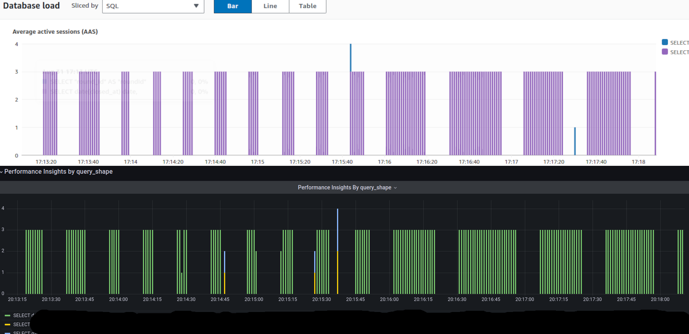

## Postgres Performance Insights Exporter

A Python script that exports PostgreSQL stats form `pg_stat_activity` and generate Prometheus metrics. Inspired by [AWS Performance insights](https://aws.amazon.com/ru/about-aws/whats-new/2018/04/rds-performance-insights-on-rds-for-postgresql/) and [PostgreSQL In-Depth Training: Performance Part 2](https://www.youtube.com/watch?v=fHlIJg4x13g)

### Installation
```bash
pip install -r requirements.txt
python postgres-performance-insights-exporter.py
```

### Docker
```js
docker run -p 9179:9179 -it --rm --name postgres-performance-insights-exporter andriik/postgres-performance-insights-exporter
docker run -it --rm --net host --name postgres-performance-insights-exporter andriik/postgres-performance-insights-exporter // host network
```

### Usage
```
usage: postgres-performance-insights-exporter.py [-h] [--port PORT]
                                                 [--db-name DB_NAME]
                                                 [--db-user DB_USER]
                                                 [--db-password DB_PASSWORD]
                                                 [--db-host DB_HOST]
                                                 [--db-port DB_PORT]
                                                 [--max-string-size MAX_STRING_SIZE]
                                                 [--interval INTERVAL]

PostgreSQL Performance Insights Exporter for Prometheus

options:
  -h, --help            show this help message and exit
  --port PORT           Port to start the Prometheus metrics server on
                        (default: 9153)
  --db-name DB_NAME     PostgreSQL database name (default: test)
  --db-user DB_USER     PostgreSQL user (default: postgres)
  --db-password DB_PASSWORD
                        PostgreSQL password (default: pass)
  --db-host DB_HOST     PostgreSQL host (default: 127.0.0.1)
  --db-port DB_PORT     PostgreSQL port (default: 5432)
  --max-string-size MAX_STRING_SIZE
                        Maximum size of query string to store (default: 1000)
  --interval INTERVAL   This determines how frequently the script will fetch
                        data from PostgreSQL (default: 1)

```

#### Environment Variables

You can use environment variables to configure the exporter. If an environment variable is set, it takes precedence over the corresponding command-line argument. Check `--help` for more info

### Authentication
Postgres User need access to `pg_stat_activity` table
```sql
-- Connect to your PostgreSQL database
\c your_database_name

-- Create the user with a password
CREATE USER exporter WITH PASSWORD 'your_password_here';

-- Grant the necessary permissions to the user
GRANT SELECT ON pg_stat_activity TO exporter;
```

### Grafana Dashboard
You can find example dashboard at id [21802](https://grafana.com/grafana/dashboards/21802)

